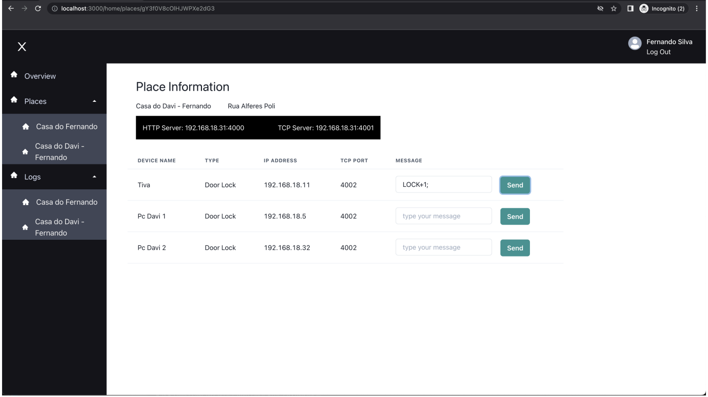

# React IOT Web Application Project

This is a IOT web project to allow users to control house devices with micro-controllers integration

# How to Run Application

- Please type npm install then npm run dev
- To Run this project you also need the Server side running in your local machine - iot-node-server-project

# Concepts and React Fundamentals

- React
- React Router DOM
- React Hook Form
- Firebase and Firestore
- Authentication

# Project Images

- Start Page

- New User Form Page

- User Overview Page

- User Places

